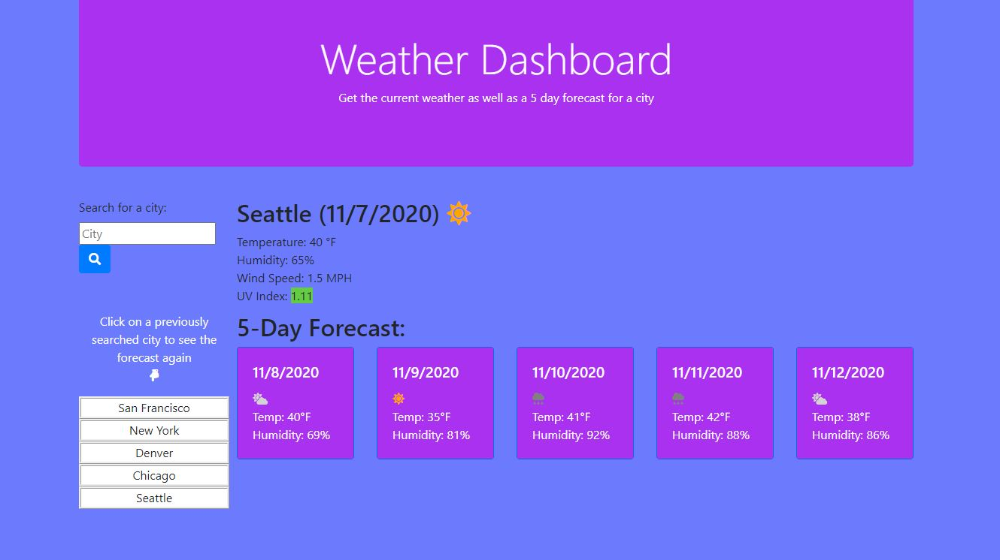

# [Weather Dashboard](https://mrtavit.github.io/weather.dashboard/)

## Welcome to my weather dashboard.

The goal of this project is the following:

    Allow a user to view the current weather conditions for a given city.
    View the 5 day weather forecast for that city.
    A list of previously searched cities is generated as cities are searched.
    Cities within the list are able to be clicked to show the forecast again for that city.
    When the page is refreshed the user will be shown the results of the city that was last searched.

